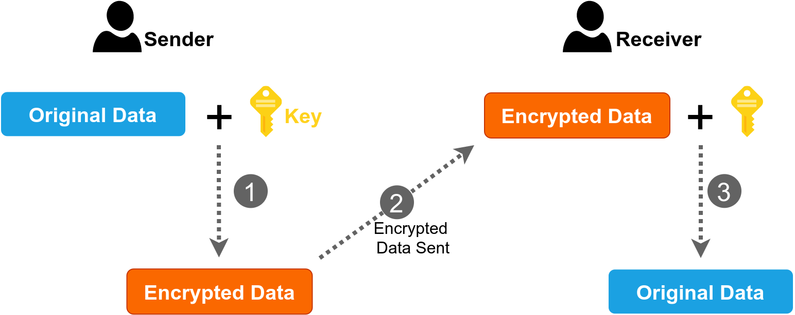
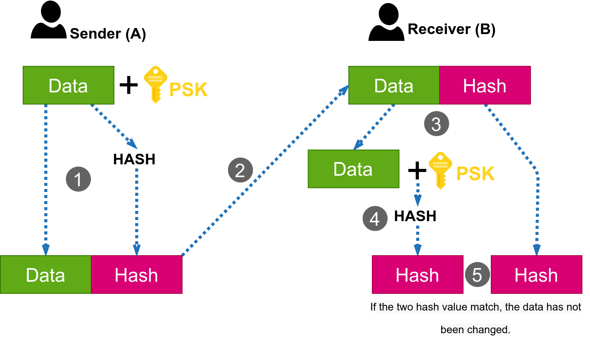
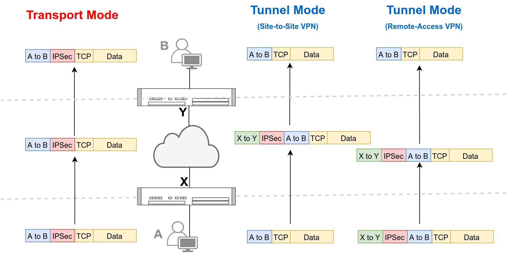

# Slide 1 
## Apa itu IPSec?

Internet Protocol Security (IPsec) merupakan protokol standar yang digunakan untuk mengamankan komunikasi IPv4 dan IPv6 dengan cara mengenkripsi data, memvalidasi data, dan mengautentikasi pengirim.

IPSec menjamin 3 prinsip keamanan yakni CIA (Confidentiality, Integrity, and Availability).

# Slide 2
## Confidentiality: Data Encryption

IPSec memastikan data yang dikirim hanya bisa dibaca oleh pengirim dan penerima dengan cara enkripsi.
- Symetric Encryption: enkripsi dan dekripsi dilakukan dengan key yang sama. Biasanya untuk mengenkripsi data yang banyak.
- Asymetric Encryption: enkripsi dan dekripsi dilakukan dengan key yang berbeda. Biasanya hanya digunakan untuk mengenkripsi data autentikasi.

# Slide 3

## Integrity: Hash Function
Data yang terenkripsi masih bisa diubah ditengah jalan. Untuk memastikan data belum diubah ketika proses transmisi, IPSec melakukan _hashing_ data.

## Availability: Source Authentication

IPSec juga menggunakan pre-shared key (PSK) untuk mengautentikasi pengirim data.

Cek slide berikutnya untuk ilustrasi proses integrity dan availablity.

# Slide 4

1. Pengirim menambahkan PSK pada data, dan melakukan _hash_ gabungan data dan PSK tersebut.
2. Pengirim menambahkan hasil proses hashing (hash value) ke data kemudian mengirimnya ke penerima.
3. Penerima memisahkan data dan hash value.
4. Penerima menambahkan PSK pada data, lalu melakukan hashing.
5. Penerima membandingkan hash value dari pengirim dan hash value miliknya. Jika sama berarti data belum diubah dan pengirim teratentikasi.

Hasil hashing akan berbeda jika PSK yang digunakan pengirim dan penerima berbeda atau jika data diubah saat proses transmisi.

# Slide 5

## Internet Key Exchange (IKE)
- IKE merupakan proses pertukaran key (kunci) dan jenis algoritma untuk melakukan enkripsi, dekripsi, dan hashing.
- IKE menggunakan UDP port 500.

**IKE Phase 1** digunakan untuk membentuk channel IPSec yang aman, kedua peer akan saling bertukar proposal yang berisi:
- Algoritma enkripsi untuk enkripsi data.
- Panjang Key untuk enkripsi.
- Algoritma Hash untuk autentikasi
- Authentication method: PSK atau RSA/DSA certificates.
- Diffie-Hellman (DH) group.

Secure channel akan terbentuk jika kedua peer mengirim minimal 1 proposal yang sama.

Setelah channel IKE Phase 1 terbentuk, 

**IKE Phase 2** digunakan untuk negosiasi jenis security protocol yang digunakan: Encapsulating Security Payload (ESP) atau Authentication Header (AH), jenis algoritma enkripsi dan algoritma hash yang akan digunakan.

# Slide 6

## IPSec Use Case

IPSec tidak hanya bisa digunakan untuk mengamankan tunnel atau VPN (tunnel mode), tetapi bisa juga digunakan untuk mengamankan komunikasi host-to-host (transport mode).

