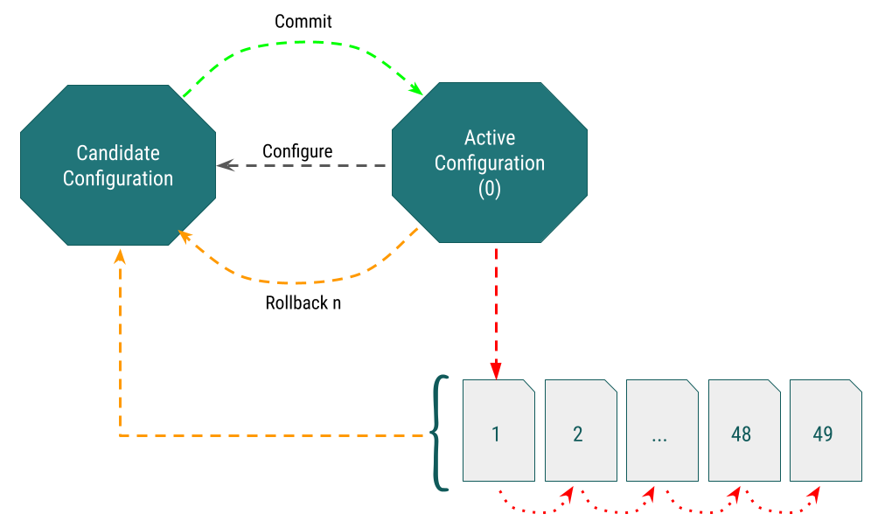

# Slide 1 


*Junos OS* merupakan sistem operasi jaringan yang dikembangkan oleh *Juniper Networks* untuk perangkat networking mereka (Juniper).

Salah satu hal unik yang dimiliki Junos OS adalah fitur konfigurasi yang mirip dengan version control system (GIT).

# Slide 2
## Candidate Configuration & Active Configuration


Ketika kita melakukan konfigurasi pada perangkat Juniper, konfigurasi tersebut tidak langsung dijalankan, melainkan konfigurasi tersebut akan disimpan dulu dan disebut *_candidate configuration_*.

Sementara itu, konfigurasi yang sedang jalan disebut *_active configuration_*. Konfigurasi ini juga akan dijalankan setiap booting.


# Slide 3
## JunOS Configuration Lifecycle


Kita perlu melakukan _commit_ agar *_candidate configuration_* berubah menjadi *_active configuration_*.

Sementara itu, *_active configuration_* yang sebelumnya akan tetap disimpan hingga 50 _commited configuration_ terakhir.

# Slide 4
## Lab: Change Configuration

Kita akan mengubah hostname perangkat dari *R-IDN* ke *R-NEW-IDN*. Konfigurasi yang kita lakukan tidak akan memberikan efek langsung ke perangkat. 

Seperti yang kamu lihat di line 5, hostname perangkat masih *R-IDN*.

```
[edit]
root@R-IDN# set system host-name R-NEW-IDN 

[edit]
root@R-IDN# 
```

# Slide 5
## Lab: Commit Configuration

Sekarang, commit konfigurasi yang telah kita ubah dan berikan komentar agar mudah dalam tracking-nya nanti. 

Jika tidak ada kesalahan pada syntax konfigurasi, akan muncul commit complete.

Seperti yang kamu lihat di line 9, hostname perangkat berubah menjadi *R-NEW-IDN*.

```
[edit]
root@R-IDN# set system host-name R-NEW-IDN 

[edit]
root@R-IDN# commit comment "change hostname to R-IDN-NEW" 
commit complete

[edit]
root@R-NEW-IDN# 
```


# Slide 6
## Lab: Failed Commit

Saat kita commit konfigurasi, Junos OS akan mengecek syntax konfigurasi yang kita commit untuk memastikan strukturnya sudah benar dan semua parameter sudah dibuat.

Jika tidak sesuai, maka commit failed dan akan muncul informasi di mana letak kesalahannya.

Contoh: 
Commit berikut error karena rules firewall "block-in" yang kita terapkan pada interface ge-0/0/0.0 belum kita buat di menu firewall family (bisa juga di firewall filter).
```
[edit]
root@R-NEW-IDN# commit 
[edit interfaces ge-0/0/0 unit 0 filter input]
  'input block-in'
    referenced filter must be defined under firewall family any
error: commit failed: (statements constraint check failed)
```

# Slide 7
## Lab: View Commit History

Kita bisa melihat riwayat commit kita menggunakan perintah berikut.

```
root@R-NEW-IDN> show system commit 
0   2021-08-02 16:11:53 WIT by root via cli
    change hostname to R-NEW-IDN
1   2021-08-02 16:11:12 WIT by root via cli
    old hostname
2   2021-08-02 16:09:56 WIT by root via other
```
Akan terdapat informasi: rollback/tracking number, kapan commit tersebut dilakukan, oleh siapa, melalui apa, dan comment-nya apa (jika ada).

Konfigurasi yang sedang dijalankan memiliki tracking number 0. 

# Slide 8
## Lab: Rollback Configuration

Jika kita ingin mengembalikan _active configuration_ ke konfigurasi sebelumnya (track number 1-49). Kita bisa gunakan perintah: `rollback <track_number>`.

```
[edit]
root@R-NEW-IDN# rollback 1 
load complete
```

Untuk membatalkan atau menghapus _candidate configuration_, gunakan perintah `rollback 0`.

# Slide 9
## Summary

Sebenarnya masih ada beberapa fitur configuration lifecycle yang belum dijelaskan di IDN Lessons kali ini, seperti cara membandingkan konfigurasi, commit confirmed, commit at, dll.

Jika teman-teman ingin belajar lebih lanjut tentang juniper, teman-teman bisa mengikuti training JNCIA-Junos di IDN.ID. Di JNCIA-Junos, kamu akan belajar terkait JunOS Fundamental, Static Route, Basic OSPF dan IS-IS, serta Packet Filtering.

Jika teman-teman sudah tau Juniper sebelumnya, kamu bisa memperdalam skill Juniper track Service Provider melalui training JNCIP-SP, tentunya di IDN.ID.

Pada training JNCIP-SP, kamu akan belajar OSPF, IS-IS, BGP, dan MPLS.

